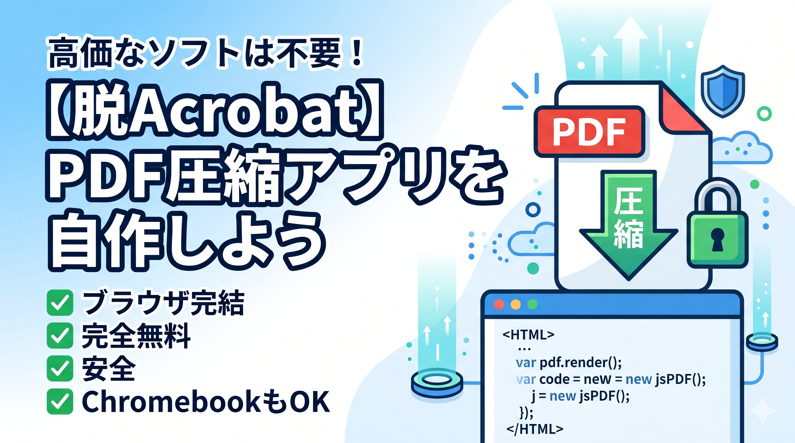

# Browser PDF Compressor (ブラウザ完結型PDF圧縮ツール)

サーバーへのアップロード不要で、完全にブラウザ内（ローカル環境）で動作するセキュアなPDF圧縮ウェブアプリケーションです。
HTML、CSS、JavaScriptのみで構成されているため、特別な環境構築は不要で、Chromebookなどの低スペックPCでもサクサク動作します。

## 📝 概要

機密書類や個人情報を含むPDFファイルを、外部サーバーに送信することなく安全にファイルサイズを縮小できます。
高・中・低の3つの圧縮レベルを備えており、用途に合わせて画質とファイルサイズのバランスを調整可能です。

## ✨ 主な特徴

- **🔒 完全ローカル処理**: サーバー通信を一切行わず、お使いのブラウザ内だけで処理が完結します。
- **⚙️ 3つの圧縮モード**: 「高圧縮」「中圧縮（標準）」「低圧縮」から選択可能。
- **🚀 環境構築ゼロ**: 1つの `index.html` ファイルを開くだけですぐに使用できます。
- **💻 クロスプラットフォーム**: Windows、Mac、そしてChromebook等の低スペックPCでも動作します。

## 🛠 使い方

1. このリポジトリをクローン、またはZIPでダウンロードします。
2. フォルダ内にある `index.html` をお好みのWebブラウザ（Chrome, Edge, Safariなど）で開きます。
3. 画面の指示に従ってPDFファイルをドラッグ＆ドロップし、圧縮レベルを選んで「圧縮を開始する」ボタンをクリックします。
4. 処理完了後、「ダウンロード」ボタンから圧縮されたPDFを保存します。

## 💻 技術スタック

- **フロントエンド**: HTML5, JavaScript (Vanilla)
- **スタイリング**: Tailwind CSS (CDN)
- **アイコン**: Lucide Icons (CDN)
- **PDF処理ライブラリ**:
  - [PDF.js](https://mozilla.github.io/pdf.js/) (PDFの読み込みとレンダリング)
  - [jsPDF](https://parall.ax/products/jspdf) (画像の再PDF化)

## ⚠️ 注意点・仕様

本ツールは、PDFの各ページを内部的に「画像化（ラスタライズ）」して画質を調整し、再度PDFとして構築し直す仕組みを採用しています。
そのため、**圧縮後のPDFファイルは、テキストの選択、コピー、および文字検索ができなくなります**ので、あらかじめご了承ください。

## 👨‍💻 開発者 (Author)

**伊藤正章 (Masaaki Ito)**

IT技術の教育とビジネス実践を軸に活動しています。30代からの再出発や、低スペックPCでも学べるIT教育を推進中です。

- **GitHub**: [https://github.com/Masaaki-jp/](https://github.com/Masaaki-jp/)
- **YouTube (Hack Ninja)**: [https://youtube.com/@hack-ninja](https://youtube.com/@hack-ninja)
- **note**: [https://note.com/masa_cloud](https://note.com/masa_cloud) (GCP、NotebookLM、Chromebook関連の教育記事)
- **はてなブログ**: [https://blog.hatena.ne.jp/musaco-life/](https://blog.hatena.ne.jp/musaco-life/) (生成AIと専門知識の実務活用)

## 📄 ライセンス (License)

This project is licensed under the MIT License - see the [LICENSE](LICENSE) file for details.
